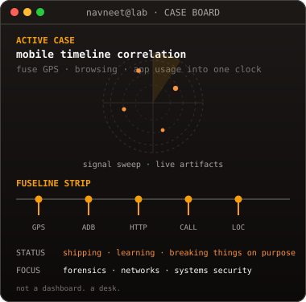

# Navneet Nanda

**timelines · packets · systems that fail honestly**

`B.Tech CSE (Cybersecurity)` · builds forensic tools, breaks assumptions

 

<table>
  <tr>
    <td width="42%" valign="top">
      
    </td>
    <td width="58%" valign="top">
      
    </td>
  </tr>
</table>

  

Signal map refreshes daily via Actions — public scrape, no token, amber not green.

---

## On the bench

| Project | What it actually does |
| :--- | :--- |
| **[fuseline](https://github.com/navneetxdd/fuseline)** | Mobile forensic timeline — correlate GPS, browsing, and app usage into one clock |
| **[Sentinel-DDoS-Mitigation-System](https://github.com/navneetxdd/Sentinel-DDoS-Mitigation-System)** | Traffic watch + automated mitigation experiments |
| **[c0mr4d35](https://github.com/navneetxdd/c0mr4d35)** | System Siege (GFG hackathon) — TypeScript under a clock |
| **[CyberShield](https://github.com/navneetxdd/CyberShield)** | Defensive tooling experiments |
| **[Florence](https://github.com/navneetxdd/Florence)** | TypeScript lab project |

---

## Stack I actually reach for

  

  
  
  
  
  

---

### how I work

`reproduce → instrument → prove → ship`  
no vibes-only security · no co-author spam in git history · evidence over aesthetics

 

profile art is custom — inspired by the idea of live terminal cards, not a fork of anyone else's face SVG.

