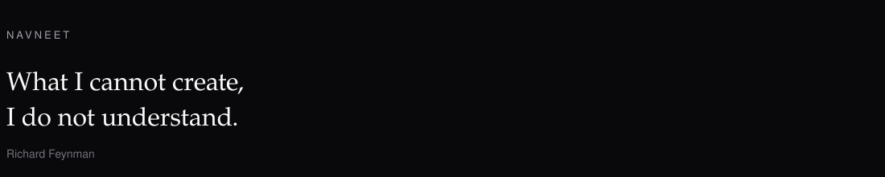

  

<table>
  <tr>
    <td width="42%" valign="top">
      
    </td>
    <td width="58%" valign="top">
      
    </td>
  </tr>
</table>

  

## Open

These have a door.

| | |
| :--- | :--- |
| **[jarv1s](https://github.com/roshansrikanth21/jarv1s)** | Voice assistant that runs on the machine. Built with the team. Roshan owns the repo. |
| **[fuseline](https://github.com/navneetxdd/fuseline)** | Location, browsing, and app use, on one clock. |

## Shut

The work is real. The links are not, because the rooms are private.

| | |
| :--- | :--- |
| **Pramaan** | DVR and NVR evidence: pull it, recover it, read it. Visitors are not on the list. |
| **m1rage** | CTF with the group. Flags do not live on a public README. |
| **Amazon ML** | 2026 entity-resolution challenge. Locked until it is allowed out. |

  
  
  
  
  
  

