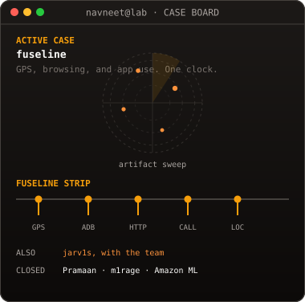

# Navneet Nanda

B.Tech CSE, Cybersecurity

Phone artifacts. One timeline.

 

<table>
  <tr>
    <td width="42%" valign="top">
      
    </td>
    <td width="58%" valign="top">
      
    </td>
  </tr>
</table>

  

---

## Work

| | |
| :--- | :--- |
| **[fuseline](https://github.com/navneetxdd/fuseline)** | Location, browsing, and app use, on one clock. |

  

  
  
  
  
  

